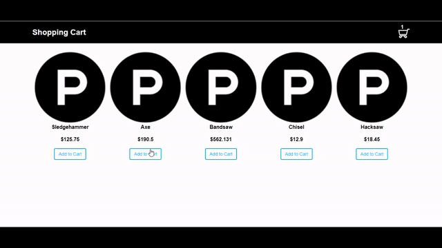

# Shopping Cart

- Implemented using PHP, CSS3, HTML. This is a simple shopping cart implementation stored in session.

## Run the application

- Clone the project in www folder
- Start WAMP/MAMP server
- Dubug the solution and run in your choice of browser.

## Project View

